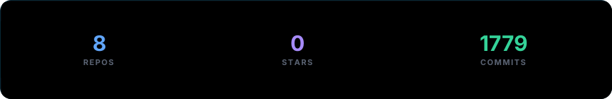

## 🛠️ Selected Works & Projects

| Project | Description | Tech Stack | Links |
| :--- | :--- | :--- | :--- |
| **Xiwat Watch Store** | A high-performance e-commerce frontend. Built complex state management logic to handle real-time product querying, dynamic filtering, and cart operations without relying on heavy external libraries. | `React` `JavaScript` `CSS Grid` `State Management` | [Live Demo](https://xiwat.vercel.app/) | [Source Code](https://github.com/Xiao-Harsh/Xiwat) |
| **Retrokey** | A technical logic and typing challenge application. Engineered the core application structure utilizing robust Java OOP principles and Garbage Collection. Optimized database interactions for seamless user state management. | `Java` `SQL` `OOP Architecture` `Data Structures` | [Source Code](https://github.com/Xiao-Harsh/RetroKey) |

***

## 📈 Journey Timeline

```
🎓 2024 - B.Tech Computer Science @ Galgotias University
         Focusing on core CS fundamentals and practical software engineering.

🏫 2023 - 12th Class @ Sarvodaya Bal Vidyalaya, Ashok Nagar, New Delhi
         Expanding skills and building software.

🏫 2021 - 10th Class @ Govt. Boys Senior Secondary School, Rajouri Garden, New Delhi
         Laying down coding foundations.
```

* **Stats**: 2+ Years Coding | 5+ Hackathons | 170+ DSA Solved Problems

***

## 🌐 Let's Connect

<p align="center">
<a href="https://www.linkedin.com/in/harsh-kumar06newdelhi/"></a><a href="https://github.com/Xiao-Harsh"></a><a href="https://www.instagram.com/im.harshsingh_?igsh=MW96bWFpc2FsNTUzOA=="></a><a href="https://x.com/imharshsingh_"></a><a href="https://codolio.com/profile/xiaoHarsh"></a><a href="mailto:harshu0631kumar@gmail.com"></a><a href="https://xiao-harsh.github.io/Xiao-Harsh/Resume.pdf"></a>
</p>

<p align="center"><sub>powered by <a href="https://github.com/collectioneur/readme-aura">readme-aura</a></sub></p>
