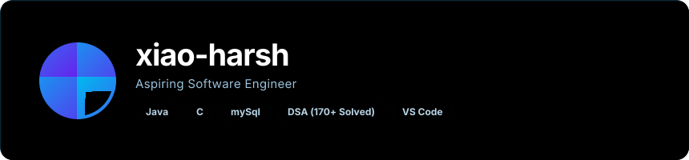
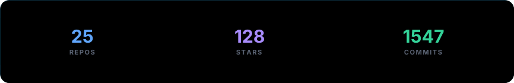

## 📈 Journey Timeline

```
🎓 2024 - B.Tech Computer Science @ Galgotias University
         Focusing on core CS fundamentals and practical software engineering.

🏫 2023 - 12th Class @ Sarvodaya Bal Vidyalaya, Ashok Nagar, New Delhi
         Expanding skills and building software.

🏫 2021 - 10th Class @ Govt. Boys Senior Secondary School, Rajouri Garden, New Delhi
         Laying down coding foundations.
```

* **Stats**: 2+ Years Coding | 5+ Hackathons | 170+ DSA Solved Problems

***

## 🌐 Let's Connect

<p align="center">
<a href="https://www.linkedin.com/in/harsh-kumar06newdelhi/"></a><a href="https://www.instagram.com/im.harshsingh_?igsh=MW96bWFpc2FsNTUzOA=="></a><a href="https://x.com/imharshsingh_"></a><a href="https://codolio.com/profile/xiaoHarsh"></a><a href="https://xiao-harsh.github.io/Xiao-Harsh/assets/Resume.pdf"></a>
</p>

<p align="center"><sub>powered by <a href="https://github.com/collectioneur/readme-aura">readme-aura</a></sub></p>
